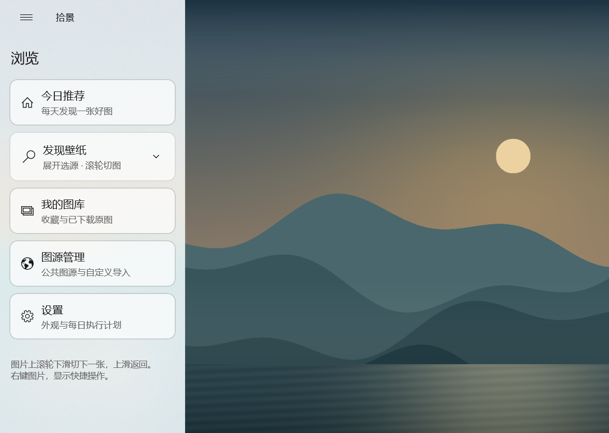
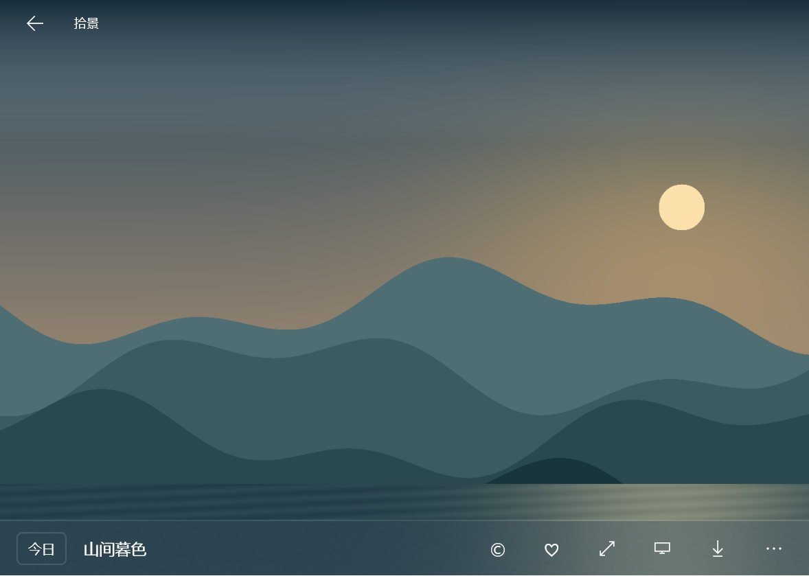

# 拾景 · Stillframe


一个免费开源的 Windows 静态壁纸软件，使用 **WinUI 3 + C#**。每天发现一张好图，也可以收藏、导入自己的图片，让喜欢的风景留在桌面上。

## 功能

- **今日推荐**：首页展示 Bing 每日图，滚轮下滑浏览历史图片，上滑返回。
- **发现壁纸**：单张大图浏览，侧栏选择 Bing 历史、Wallhaven 热门/最新/搜索、Wikimedia Commons 或本地图库；同一浏览会话避免重复推荐。
- **我的图库**：收藏、导入图片或文件夹，保存原图；支持 HTTPS 图片直链和自定义 JSON 图源清单。
- **桌面与锁屏**：右键图片或打开详情，可以设为桌面/锁屏壁纸；桌面支持显示器选择与填充方式。
- **简洁界面**：圆角侧栏、半透明信息卡、全屏预览、明暗主题及区域加载提示。
- **每日任务**：可选自动更换桌面/锁屏和通知，默认关闭，仅在软件运行时执行。

## 界面

下面是实际 WinUI 界面截图，使用项目原创演示图；发布包不捆绑网络壁纸或私人图库。





## 下载与安装

前往 [Releases](https://github.com/sxwer001/Stillframe/releases) 下载 **0.1.0 试用版**。支持 Windows 10 2004（build 19041）及以上的 **x64** 系统，包含 .NET 与 Windows App SDK 运行依赖。

**便携 ZIP**：下载 `Stillframe-0.1.0-win-x64.zip`，解压整个文件夹，双击 `Stillframe.exe`。不要只复制 EXE；便携版未做 EXE 代码签名。

**自签名 MSIX**：下载以下三个文件并放在同一个文件夹：

- `Stillframe-0.1.0-win-x64.msix`
- `Stillframe-Trial.cer`（仅公开证书，不含私钥）
- `Install-Stillframe.ps1`

核对 Release 的 `SHA256SUMS.txt` 后，在该文件夹打开**管理员 Windows PowerShell**，执行：

```powershell
powershell.exe -NoProfile -ExecutionPolicy Bypass -File .\Install-Stillframe.ps1
```

脚本显示发布者 `CN=Stillframe` 和证书 SHA256，输入 `INSTALL` 后才将证书导入**本地计算机 → 受信任人（Trusted People）**，并为当前用户安装。安装后从开始菜单打开“拾景 · Stillframe”。自签名证书不是微软商店认证，Windows 默认不信任；如果不希望导入证书，使用便携 ZIP。证书信任不会随应用卸载自动移除。[微软自签名安装说明](https://learn.microsoft.com/en-us/windows/msix/package/create-certificate-package-signing)

两种版本沿用 `%LOCALAPPDATA%\Shijing` 存储图库和设置，保留原来的数据目录。导入复制原图，不修改源文件；卸载或更新程序不会主动删除图库。更新前建议备份此目录，同一时间只运行一个版本。

## 使用

左上角横杠打开侧栏；展开“发现壁纸”选择图源。鼠标在大图上滚动切换图片，点击信息卡进入详情，右键打开快捷操作。收藏和下载后的原图可以离线查看，首次获取在线图片需要网络。

自动更换与通知在设置中启用；退出软件后停止执行。Unsplash、Pixiv 等目前只有官网入口，没有接入壁纸 API。图源可能受网络、接口变更和限额影响，摄影作品仍归作者所有，软件的 MIT 许可不包含图片版权。

这是初版试用发布。已验证的范围与记录见 [当前状态](docs/context/NOW.md#验证状态)；其他设备安装、真实桌面/锁屏效果和用户体验仍需验收。

## 从源码构建

需要 Windows x64、[global.json](global.json) 指定的 .NET SDK 和可访问的 NuGet 源；制作 MSIX 另需 Windows SDK 的 MakeAppx、SignTool 及 PowerShell 7。

```powershell
./scripts/build.ps1 -Publish
./scripts/check.ps1
./scripts/run.ps1
```

输出为 `artifacts/Stillframe-win-x64/`。打包使用 `scripts/package.ps1`（ZIP）或 `scripts/package-msix.ps1`（自签名 MSIX）；脚本不会自动上传、信任证书或安装。完整步骤见 [RUNBOOK](docs/context/RUNBOOK.md#试用版msix与公开发布)。

应用代码使用 [MIT](LICENSE)。运行依赖的许可随包保存在 `ThirdPartyLicenses/`，见 [第三方说明](ThirdPartyNotices.txt)。

## 项目文档

[项目索引](PROJECT_INDEX.md) · [当前进展](docs/context/NOW.md) · [目录与配置](docs/context/MAP.md) · [开发方案](docs/Windows壁纸软件-详细开发方案.html) · [AI 协作规则](AGENTS.md)
